# Kali in VMWare Fusion for MacOS Warriors

Kali is great. I love it for all the tools it comes with and use it all the time for pentesting. Even though VMWare Fusion does a relatively good job with the default key-mapping to make the experience a little better, it's always been an issue for me. There's just a lot of incompatibility between the shortcuts I use on my mac - and what works with kali / xfce. Window / workplace switching, shortcuts not working, opening some random menus all the time.

It's nobody's fault to be honest. If anything apple could stop being so _✨different✨_ and just use the same keyboard layout as everyone else. Sure, this would be a baptism by fire, and some die-hard mac users would probably be upset for some time, but overall I think it would be worth it. No need for special mac keyboards, re-binding keys or hybid keyboards - like the Logitech K860 that I use. Well, a man can dream, but for the time being I decided to put some time and effort into researching how to make the experience better with various configurations, here's what works for me:

### 1. Increase resources for Kali VM
This isn't a keybind change, but just a friendly reminder. If you're like me and working with kali in fullscreen mode, pretty much forgetting about MacOS in the background - give it some more juice. I use 6 cores and 4gb of ram. 

_(50% of the cores you have is actually the maximum recommended by VMWare. I reckon you could go higher, especially with beefier macs, but that has been enough for me so far)._ 

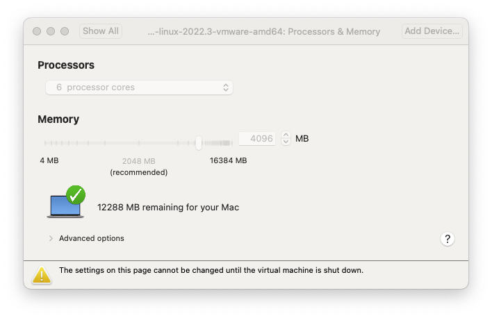

### 2. Changes In VMWare Fusion:

1. Disable Mac host shortcuts, this will enable you to `Cmd+Tab` inside Kali, as well as prevent switching MacOS Workplaces:

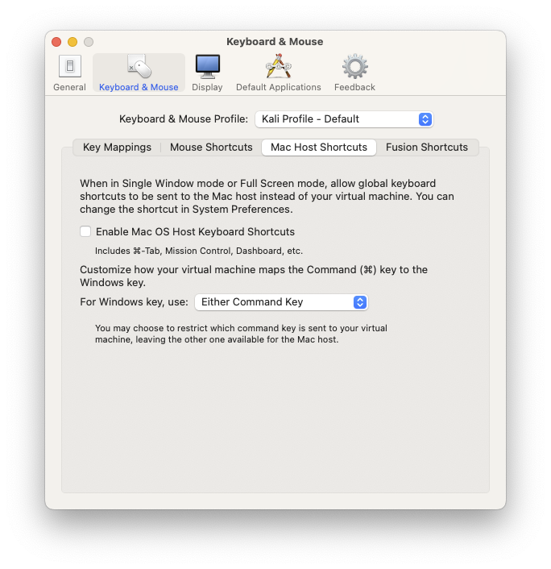

2. Disable `Cmd+W` and `Cmd+F` shortcuts. `Cmd+W` is bound to `Alt+F4` which will close the entire window, it's been an issue for me because I want to use `Cmd+W` to close tabs in FireFox or editors in VSCode. `Cmd+F` has not been an issue, but I disabled in just in case.
3. Instead, assign `Cmd+W` to `Ctrl+W` - most applications will have the tab closing behaviour that I wanted bound to this.
4. Assign `Cmd+B` to `Ctrl+B`, so you can use the `Cmd` key in tmux. Change this if you use a different shortcut in tmux. 
5. Bind `Cmd+Shift+C` to `Ctrl+Shift+C` for interrupting processes in the terminal. 
6. Bind `Cmd+Left` and `Cmd+Right` to `Ctrl+Left` and `Ctrl+Right` for jumping by words in the terminal. _What's best about these configurations, is that they are still working with the original `Ctrl` key, so it doesn't matter which one you hit._

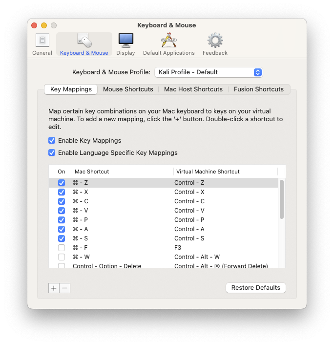
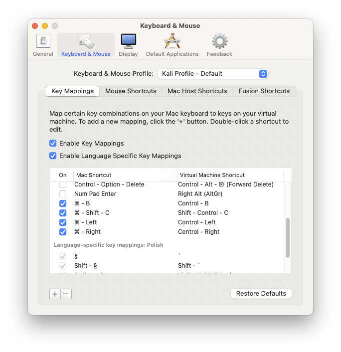

5. In fusion shortcuts, disable `Cmd+Q` so it doesn't quit the vm accidentally.

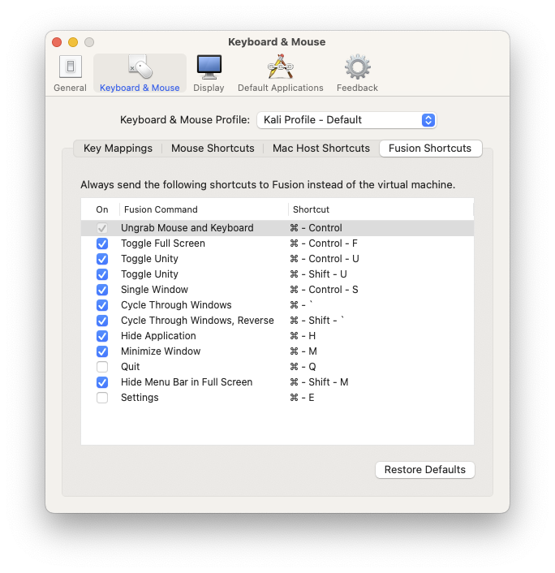

6. All the remaining configuration has been fine for me.

### 3. In Kali:
_Every setting I describe is accessed from the Settings Manager_

#### 3.1 Window Manager

1. In `Window Manager`, move the button layout to the left, for that familiar MacOS feel.

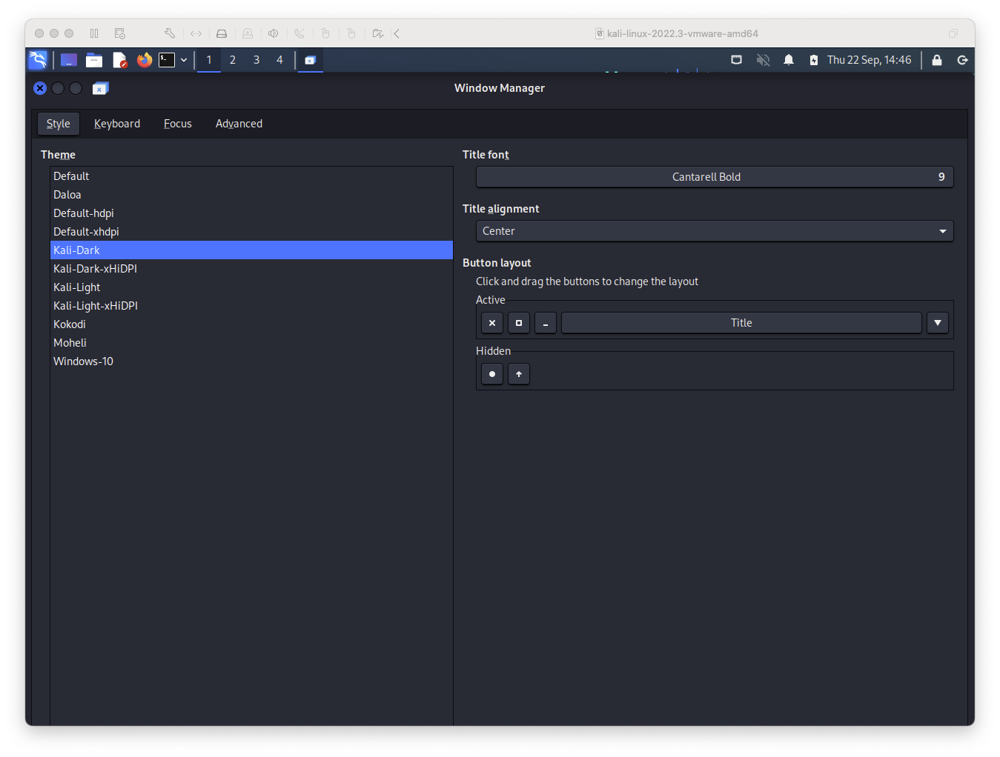

#### 3.2 Keyboard section in Window Manager

1. Bind Cycling Windows to `Super+Tab`, instead of control, and disable the reverse cycling.
2. Disable window tiling by using arrows, as well as minimising / maximising. This was quite annoying for me, but feel free to leave it if you want to embrace this flow.
3. Bind Switching Workplaces left and right to `Ctrl+Shift+Left/Right` and disable the Up/Down movement. I orignally wanted this to be just `Ctrl+Left/Right`, like on MacOS, but this interferes with jumping by words in the terminal which was a deal breaker. If you prefer workplace changes over jumping in terminal you can use the familiar Mac shortcut.

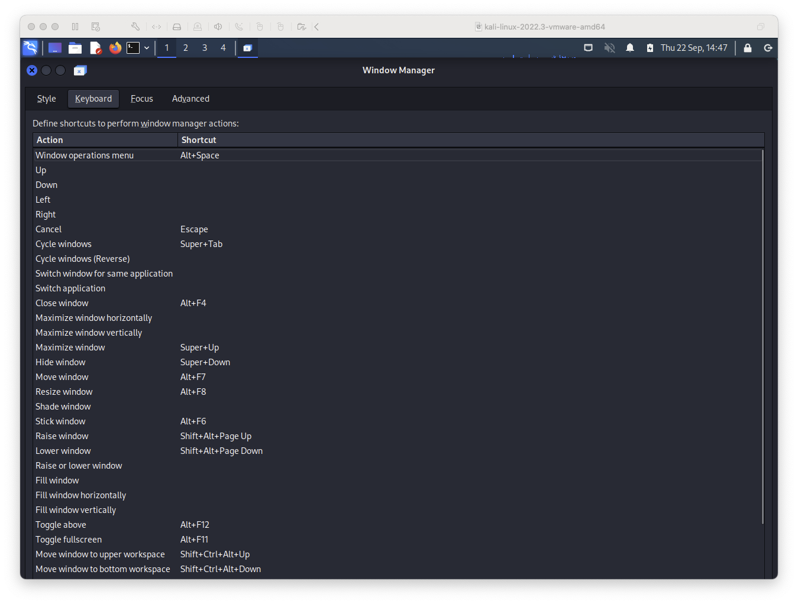
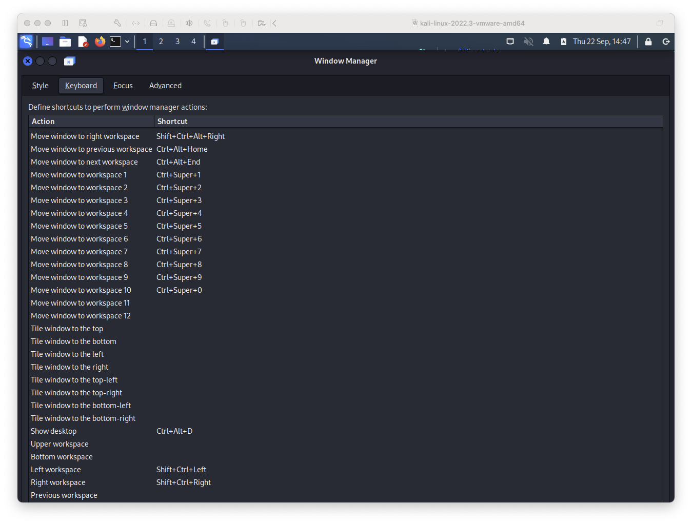

#### 3.3 Global Keyboard section

1. Disable `xfce4-popup-whiskermenu` shortcut. I was triggering accidentally all the time. 
2. Bind `xfce4-popup-whiskermenu --pointer` to `Super+Space`, which will behave kind of like spotlight. **This is sometimes hard to hit, if it appears as `Super L`, it's not the right shortcut.** For whatever reason it seems to see the `Cmd` key as `Super L`, and you will trigger it with each hit of the `Cmd` button which is annoying. Keep trying to hit `Super+Space`.
3. Bind `xflock4` _(which is the screen lock)_, to `Super+L` and remove the others.

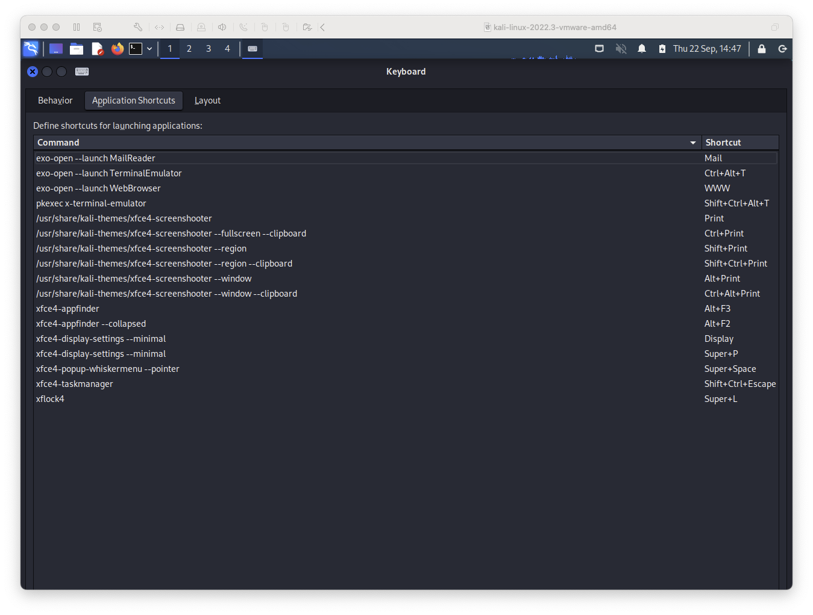

#### 3.4 Mouse section
In the mouse window, enable _'Reverse Scroll Direction'_, if you're used to this from MacOS.

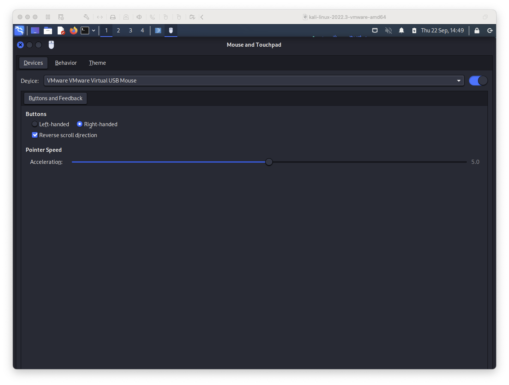

### 4. VSCode changes 
_I use VSCode in Kali, as I think it's the most versitale editor, which comes in handy during a pentest. I imagine you can configure this accordingly with any other editor of choice._

VSCode does not come with the ability to choose the MacOS keyboard layout on Linux install. To get the familiar feel you will need to:

1. Open Default Keyboard Shortcuts (JSON), from the comand palette. 
2. Open Keyboard Shortcuts (JSON) in another tab.
3. Copy the entire default configuration to the new one.
4. Replace linux shortcuts with `Ctrl+Shift+F`. Replace `ctrl` with `cmd`, and `alt` with `super`.
5. Remove _View: Toggle Tab Visibility_ bound to `Super+W`, which is conflicting with the _Close Window_ shortcut.

I'm attaching the edited config [vscode.json](./assets/vscode.json).

### 5. Terminal changes
In the terminal, we will benefit from all of the changes we've already configured. All that's left is to rebind Coping and Pasting to `Ctrl+C` and `Ctrl+V`. That's just what I use, and if you're used to the default configuration there's nothing to change.

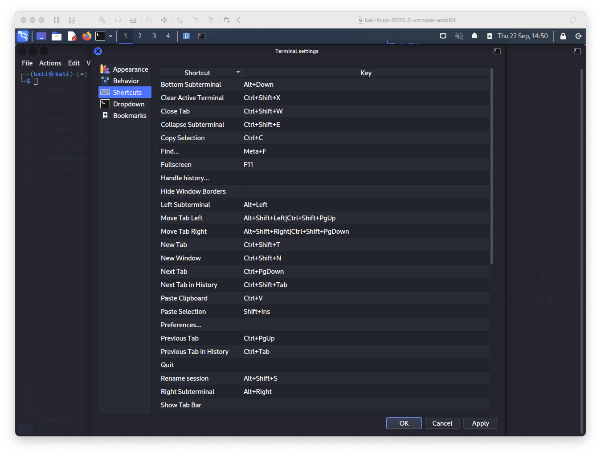

### 6. Browser changes
I'm personally very used to closing browser tabs with `Cmd+W`, this should be already by working by binding `Cmd+W` to `Ctrl+W` in Fusion, as well as disabling the `Alt+F4` bind which would close the browser. In firefox is somehow impossible to rebind this to anything else.

### 7. Escaping the VM 
By disabling MacOS host shortcuts you won't be able to just `Ctrl+Left/Right` to escape the VM in fullscreen. You will need to use `Cmd+Ctrl` to ungrab the cursor from the VM.

## End Remarks

I know this is quite a bit of work to configure (_and belive me when I say, it was even more to discover all of this_). For me this was a huge improvement in my workflow so I can assure you it's worth it, if you're used to working with MacOS on a daily basis. There's no need to buy a separate keyboard or re-train all the muscle memory!

I hope this has been useful and saved you some searching! I continue to test this setup and will uptdate it with new findings.